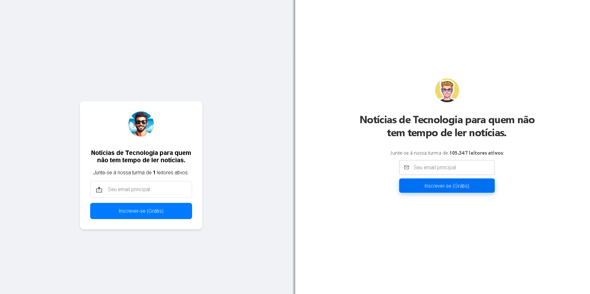

    

# Da Inspiração à Ação: Criando uma Newsletter com o Toque da IA e a Essência do Filipe Deschamps!
> Minha Newsletter Inspirada no Filipe Deschamps

Bem-vindo ao meu projeto de newsletter, uma homenagem à incrível e inspiradora newsletter do Filipe Deschamps! Ele é uma referência no universo da tecnologia e sua capacidade de conectar e engajar o público é algo impressionante. Com este projeto, busquei explorar o poder da inteligência artificial e as tecnologias modernas para criar uma experiência única e acessível.

## Sobre o Projeto

Neste projeto, utilizei o ChatGPT-4 para auxiliar na criação de conteúdo e na estruturação da newsletter. A ideia é oferecer uma plataforma onde os usuários possam se inscrever e receber atualizações sobre temas relevantes, de forma simples e direta. A inspiração vem da forma como o Filipe aborda assuntos complexos de maneira leve e divertida.

> [!NOTE]
> Não se inscreva-se. Realmente é apenas um projeto e você não leu errado. Não enviarei SPAM ou algo malicioso. Dê preferência você pode acompanhar em meu [blog](https://jeiel-blog.vercel.app/).
> Como foi feito meu blog usando TabNews: https://www.tabnews.com.br/JeielLimaMiranda/tabnews-em-meu-blog

## Tecnologias Utilizadas

- **Frontend**: HTML, CSS, JavaScript
- **Framework**: Vite - para um desenvolvimento rápido e eficiente.
- **Backend**: Node.js - garantindo uma experiência fluida e responsiva.
- **Storage**: Firebase Storage - para gerenciar os dados coletados.
- **Hosting**: Vercel - para uma publicação rápida e fácil.

## Diferencial

| Características                     | Jeiel  Miranda                  | Filipe Deschamps          |
|-------------------------------------|---------------------------|---------------------------|
| Conteúdo sobre tecnologia            | ✅                        | ✅                        |
| Funcional                           | ✅                        | ✅                        |
| Duplicação de e-mail                | ✅                        | ❌                        |
| reCAPTCHA                           | ❌                        | ✅                        |
| Mais de 100 mil inscritos            | ❌                        | ✅                        |
| E-mails permitidos específicos        | ✅                        | ❌                        |

## Funcionalidades

- **Simplicidade e Acessibilidade**: A interface foi projetada para ser limpa e intuitiva, utilizando emojis e placeholders padrão que tornam a navegação mais amigável.
- **Validação de Email**: Para garantir a qualidade da lista de assinantes, implementei uma validação que evita emails duplicados e limita as inscrições a domínios específicos, como Gmail, Duck.com e Hotmail.com.

## Por que este projeto?

Acredito que a tecnologia deve ser utilizada para facilitar a comunicação e a troca de ideias. Este projeto é uma forma de explorar como a inteligência artificial pode ser aplicada na criação de conteúdo e na interação com o público. Embora eu saiba que não se compara à qualidade e ao impacto da newsletter do Filipe Deschamps, é uma oportunidade de aprendizado e crescimento.

## Concluindo...

Estou empolgado para compartilhar este projeto com vocês e espero que ele inspire outros a explorar o potencial da tecnologia e da inteligência artificial. Agradeço ao Filipe Deschamps pela inspiração e por ser uma referência tão importante na comunidade.

**Dev**: [@filipedeschamps](https://filipedeschamps.com.br/newsletter) - Obrigado pelas notícias diárias!

> Sinta-se à vontade para conferir o projeto, dar feedback e, quem sabe, se inscrever para receber as novidades! 

XD

